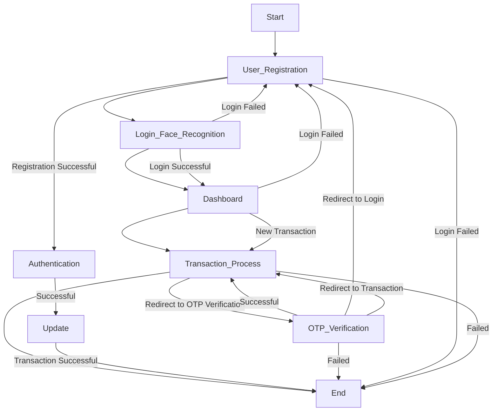

# Face Recognition Transaction System

This project implements face recognition for a transaction system using Keras, OpenCV, data augmentation, and OTP verification with Django as the backend.




## Overview

The Face Recognition Transaction System is designed to enhance security and convenience in financial transactions by implementing a face recognition system. This system verifies the identity of users through their facial features and integrates OTP (One Time Password) verification for additional security.

## Features

- Face recognition using Keras and OpenCV.
- Data augmentation techniques for improving model performance.
- OTP verification for secure transactions.
- User-friendly interface for seamless interaction.
- User perform curd operations to manage their profile

## Installation

1. Clone the repository:

    ```bash
    git clone https://github.com/kashishsinghyadav/Face-Recogination-for-online-transaction-.git
    ```

2. Install the required dependencies:

    ```bash
    pip install -r requirements.txt
    ```

3. Download the pre-trained model weights for face recognition.

4. Apply database migrations:

    ```bash
    python manage.py migrate
    ```

5. Run the Django server:

    ```bash
    python manage.py runserver
    ```

## Usage

1. Launch the Django server.
2. Register your face by following the instructions.
3. Initiate a transaction.
4. The system will verify your identity through face recognition.
5. Enter the OTP received on your registered device to complete the transaction.

## Contributing

Contributions are welcome! Please feel free to fork the repository and submit pull requests to suggest improvements or add new features.

## License

This project is licensed under the MIT License - see the [LICENSE](LICENSE) file for details.

## Contact

For any inquiries or support, please contact [kashish ](mailto:kashishhsinghhh@gmail.com).

