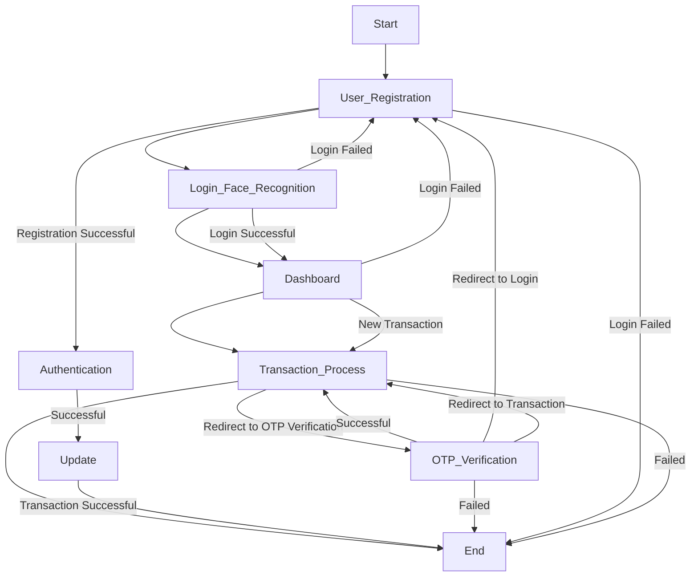

# Face Recognition Transaction System

## Project Description

This project implements an online transaction system with face recognition using Keras and OpenCV, along with data augmentation techniques for enhanced model performance. It incorporates Razorpay as the payment gateway for secure transactions and OTP verification. Django serves as the backend framework.

# Flowchart



## Project Srceenshot
<details>
<summary><strong>Screenshots (click to expand)</strong></summary>

<!-- Add your screenshots here -->
## Home Page


## Registration Page
    # user register themselves using credential
    ``` 
    faceid(unique),
    Name,
    email,
    address,
    Phone number,
    uploadimage
    ```


## Login 
    # It done by the real time camera 


## User Dashboard
    # the specifc user dashboard which user login successfully


 ## User details 
    #  user also update thier details upload their image
    


## Transaction Page 
Intergrate Razorpay  Payment gateway 

step 1:
    


step 2:


step3 3:
    


step 4:


step 5:
     


## OTP Page
    # user enter the register email


## Verification Page
    # user enter the otp(6 digits) which is send to mail


## Successful Transaction
    # if otp is authenticate then transaction became succesful


<!-- Add more screenshots as needed -->


</details>

## Overview

The Face Recognition Transaction System is designed to enhance security and convenience in financial transactions by implementing a face recognition system. This system verifies the identity of users through their facial features and integrates OTP (One Time Password) verification for additional security.

## Architecture of the face recognition model using a Convolutional Neural Network (CNN)
    


## Features

- Face recognition using Keras and OpenCV.
- Data augmentation techniques for improving model performance.
- OTP verification for secure transactions.
- User-friendly interface for seamless interaction.
- CRUD operations to manage user profiles.
- Integration of Razorpay payment gateway for secure transactions.


## Installation

1. Clone the repository:

    ```bash
    git clone https://github.com/kashishsinghyadav/Face-Recogination-for-online-transaction-.git
    ```

2. Install the required dependencies:

    ```bash
    pip install -r requirements.txt
    ```

3. Download the pre-trained model weights for face recognition.

4. Apply database migrations:

    ```bash
    python manage.py migrate
    ```

5. Run the Django server:

    ```bash
    python manage.py runserver
    ```

## Usage

1. Launch the Django server.
2. Register your face by following the instructions.
3. Initiate a transaction.
4. The system will verify your identity through face recognition.
5. Enter the OTP received on your registered device to complete the transaction.

## Contributing

Contributions are welcome! Please feel free to fork the repository and submit pull requests to suggest improvements or add new features.

## License

This project is licensed under the MIT License - see the [LICENSE](LICENSE) file for details.

## Contact

For any inquiries or support, please contact [kashish ](mailto:kashishhsinghhh@gmail.com).


